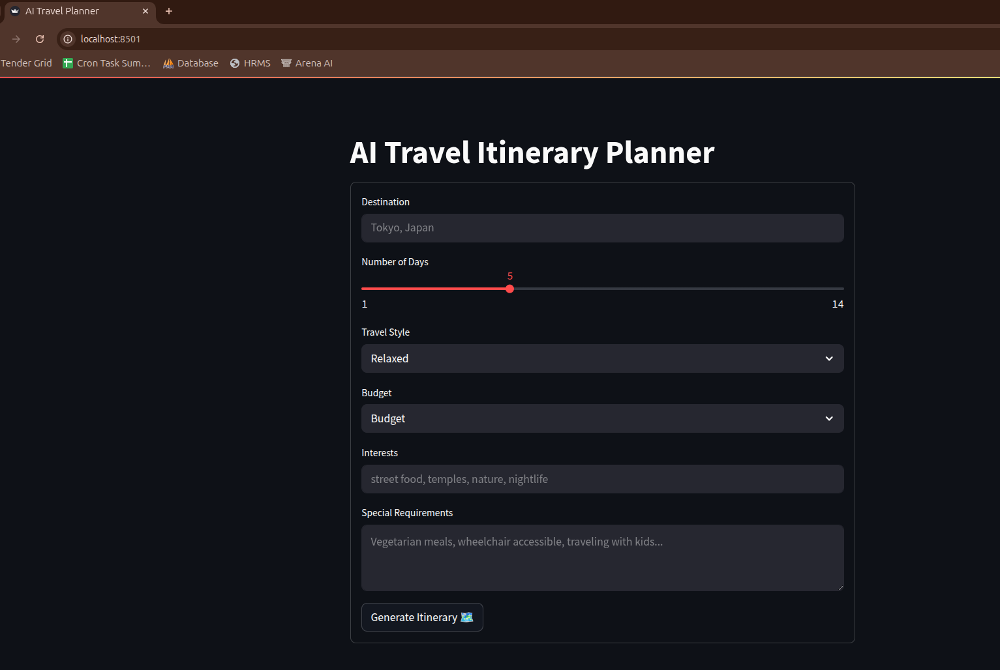

# AI-Powered Travel Itinerary Planner

## 🌍 About The Project

Planning a trip can be overwhelming — researching attractions, restaurants,
logistics, and trying to fit everything into a coherent schedule takes hours.

**AI Travel Itinerary Planner** solves this by combining the reasoning power
of Large Language Models with **real-time search data** to generate complete,
personalized travel plans in seconds.

Simply enter your destination, travel dates, style preferences, and interests.
The app researches your destination using live search results, then crafts a
detailed day-by-day itinerary tailored exactly to you.

### 🤔 Why This App?

| Problem | Solution |
|---|---|
| Generic travel guides don't match personal preferences | LLM personalizes every itinerary to your style and interests |
| LLMs hallucinate outdated info (closed restaurants, wrong hours) | Tavily search injects **real-time, current** destination data |
| Manual trip planning takes 5-10 hours | Full itinerary generated in **under 30 seconds** |
| Expensive travel planning services | Completely free and open source |

---

## ✨ Features

- 🗺️ **Day-by-Day Itineraries** — Structured morning, afternoon, and evening
  activities for every day of your trip
- 🔍 **Real-Time Search Integration** — Powered by Tavily API for current
  attraction info, restaurant recommendations, and travel tips
- 🎨 **Travel Style Personalization** — Choose from Relaxed, Adventure,
  Cultural, Foodie, or Budget Backpacker styles
- 💰 **Budget-Aware Planning** — Itineraries adapt to Budget, Mid-Range, or
  Luxury spending levels with estimated daily costs
- 🍽️ **Restaurant Recommendations** — Specific dining suggestions for each day
  based on your cuisine preferences
- 💡 **Insider Pro Tips** — Each day includes a local tip that most tourists miss
- ♿ **Special Requirements Support** — Accommodates dietary restrictions,
  accessibility needs, family travel, and more
- 🖥️ **Clean Web Interface** — Simple, intuitive Streamlit UI that anyone can use
- ⚡ **Fast Generation** — Complete itineraries in 15-30 seconds

---

## 🎬 Demo

  

---

## 🛠️ Tech Stack

| Component | Technology | Purpose |
|---|---|---|
| **Framework** | LangChain 0.3 | LLM orchestration, prompt management, chain composition |
| **LLM** | OpenAI GPT-4o-mini | Natural language generation for itineraries |
| **Search** | Tavily API | Real-time web search for current destination data |
| **Web UI** | Streamlit | Interactive web interface |
| **Language** | Python 3.10+ | Core application language |
| **Chain Pattern** | LCEL (LangChain Expression Language) | Composable prompt → LLM → output pipeline |

---